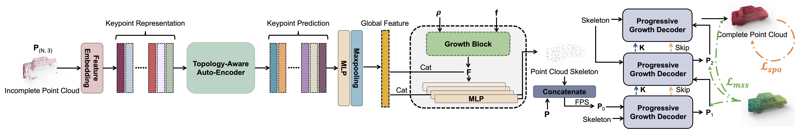

# Progressive Growth for Point Cloud Completion by Surface-projection Optimization

[[Paper]](https://ieeexplore.ieee.org/abstract/document/10485518) 
<!-- [[Models]](#pretrained-models) -->

This repository contains PyTorch implementation for __Progressive Growth for Point Cloud Completion by Surface-projection Optimization__ (TIV2024).

Point cloud completion concentrates on completing geometric and topological shapes from incomplete 3D shapes. Nevertheless, the unordered nature of point clouds will hamper the generation of high-quality point clouds without predicting structured and topological information of the complete shapes and introducing noisy points. To effectively address the challenges posed by missing topology and noisy points, we introduce SPOFormer, a novel topology-aware model that utilizes surface-projection optimization in a progressive growth manner. SPOFormer consists of three distinct steps for completing the missing topology: (1) Missing Keypoints Prediction. A topology-aware transformer auto-encoder is integrated for missing keypoint prediction. (2) Skeleton Generation. The skeleton generation module produces a new type of representation named skeletons with the aid of keypoints predicted by topology-aware transformer auto-encoder and the partial input. (3) Progressively Growth. We design a progressive growth module to predict final output under Multi-scale Supervision and Surface-projection Optimization. Surface-projection Optimization is firstly devised for point cloud completion, aiming to enforce the generated points to align with the underlying object surface. Experimentally, SPOFormer model achieves an impressive Chamfer Distance-L1 (CD) score of 8.11 on PCN dataset. Furthermore, it attains average CD-L2 scores of 1.13, 1.14, and 1.70 on ShapeNet-55, ShapeNet-34, and ShapeNet-Unseen21 datasets, respectively. Additionally, the model achieves a Maximum Mean Discrepancy (MMD) of 0.523 on the real-world KITTI dataset. These outstanding qualitative and quantitative performances surpass previous approaches by a significant margin, firmly establishing new state-of-the-art performance across various benchmark datasets. 




## Usage

### Requirements

- PyTorch >= 1.7.0
- python >= 3.7
- CUDA >= 9.0
- GCC >= 4.9 
- torchvision
- timm
- open3d
- tensorboardX

```
pip install -r requirements.txt
```

#### Building Pytorch Extensions for Chamfer Distance, PointNet++ and kNN

*NOTE:* PyTorch >= 1.7 and GCC >= 4.9 are required.

```
# Chamfer Distance
bash install.sh
# PointNet++
pip install "git+git://github.com/erikwijmans/Pointnet2_PyTorch.git#egg=pointnet2_ops&subdirectory=pointnet2_ops_lib"
# GPU kNN
pip install --upgrade https://github.com/unlimblue/KNN_CUDA/releases/download/0.2/KNN_CUDA-0.2-py3-none-any.whl
```

### Dataset

The details of our new ***ShapeNet-55/34*** datasets and other existing datasets can be found in [DATASET.md](./DATASET.md).

### Evaluation

To evaluate a trained SPOFormer model on the Three Dataset with single GPU, run:

```
bash ./scripts/test.sh <GPU_IDS> --ckpts <path> --config <config> --exp_name <name> [--mode <easy/median/hard>]
```

####  Some examples:
Test the SPOFormer trained model on the PCN benchmark:
```
bash ./scripts/test.sh 0 --ckpts ./pretrained/SPOFormer_PCN.pth --config ./cfgs/PCN_models/SPOFormer.yaml --exp_name example
```
Test the SPOFormer trained model on ShapeNet55 benchmark (*easy* mode):
```
bash ./scripts/test.sh 0 --ckpts ./pretrained/SPOFormer_ShapeNet55.pth --config ./cfgs/ShapeNet55_models/SPOFormer.yaml --mode easy --exp_name example
```
Test the SPOFormer trained model on the KITTI benchmark:
```
bash ./scripts/test.sh 0 --ckpts ./pretrained/SPOFormer_KITTI.pth --config ./cfgs/KITTI_models/SPOFormer.yaml --exp_name example
```

### Training

To train a point cloud completion model from scratch, run:

```
# Use DistributedDataParallel (DDP)
bash ./scripts/dist_train.sh <NUM_GPU> <port> --config <config> --exp_name <name> [--resume] [--start_ckpts <path>] [--val_freq <int>]
# or just use DataParallel (DP)
bash ./scripts/train.sh <GPUIDS> --config <config> --exp_name <name> [--resume] [--start_ckpts <path>] [--val_freq <int>]
```
####  Some examples:
Train a SPOFormer model on PCN benchmark with 2 gpus:
```
CUDA_VISIBLE_DEVICES=0,1 bash ./scripts/dist_train.sh 2 13232 --config ./cfgs/PCN_models/SPOFormer.yaml --exp_name example
```
Resume a checkpoint:
```
CUDA_VISIBLE_DEVICES=0,1 bash ./scripts/dist_train.sh 2 13232 --config ./cfgs/PCN_models/SPOFormer.yaml --exp_name example --resume
```

Finetune a SPOFormer on PCNCars
```
CUDA_VISIBLE_DEVICES=0,1 bash ./scripts/dist_train.sh 2 13232 --config ./cfgs/KITTI_models/SPOFormer.yaml --exp_name example --start_ckpts ./weight.pth
```

Train a SPOFormer model with a single GPU:
```
bash ./scripts/train.sh 0 --config ./cfgs/KITTI_models/SPOFormer.yaml --exp_name example
```

We also provide the Pytorch implementation of several baseline models including GRNet, PCN, TopNet and FoldingNet. For example, to train a GRNet model on ShapeNet-55, run:
```
CUDA_VISIBLE_DEVICES=0,1 bash ./scripts/dist_train.sh 2 13232 --config ./cfgs/ShapeNet55_models/GRNet.yaml --exp_name example
```

### Completion Results on ShapeNet55 and KITTI-Cars


## License
MIT License

## Acknowledgements

Our code is inspired by [GRNet](https://github.com/hzxie/GRNet), [mmdetection3d](https://github.com/open-mmlab/mmdetection3d), [PoinTr](https://github.com/yuxumin/PoinTr) and [SnowflakeNet](https://github.com/AllenXiangX/SnowflakeNet).

## Citation
If you find our work useful in your research, please consider citing:
```
@article{fei2024progressive,
  title={Progressive Growth for Point Cloud Completion by Surface-Projection Optimization},
  author={Fei, Ben and Zhang, Rui and Yang, Weidong and Li, Zhijun and Chen, Wen-Ming},
  journal={IEEE Transactions on Intelligent Vehicles},
  year={2024},
  publisher={IEEE}
}
```
